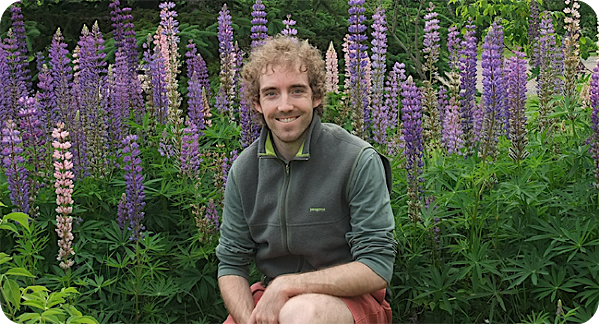

My name is Dave. I was born in Pontiac, MI and grew up in Clarkston, MI (see map below). I then spent a decade in Ann Arbor, MI, where I  received a B.S. in Geology with a Physics minor from the [University of Michigan](http://www.umich.edu/). I decided to stick around Ann Arbor and received my Ph.D. in Geology from the [Department of Geological Sciences](http://www.lsa.umich.edu/earth/) (now Earth and Environmental Sciences) in 2008. Four days after turning in my final dissertation revisions, I began a postdoctoral research project in the [Géosciences laboratory](http://www.geosciences.univ-rennes1.fr/) at the [Université de Rennes 1](https://www.univ-rennes1.fr/), France. After nine excellent months in Rennes, I returned to North America to continue the postdoctoral project in the Department of Oceanography at [Dalhousie University](http://www.dal.ca/) in Halifax, Nova Scotia, Canada. Since 2013 I have been an Professor of Geodynamic Modelling in the [Department of Geosciences and Geography](http://www.helsinki.fi/geo/english/index.html) at the [University of Helsinki](http://www.helsinki.fi/university/), Finland.

When I'm not working, I like to hang out with my wife Alyce and our two goofy kids. If there's any spare time, I enjoy playing ultimate, drinking [good beer](http://dieuduciel.com/en/), biking and music.

<iframe src="https://www.google.com/maps/d/embed?mid=1pL4LQlArLyRtpnEG-mNS-nqjLEU&hl=en" width="800" height="480"></iframe>
